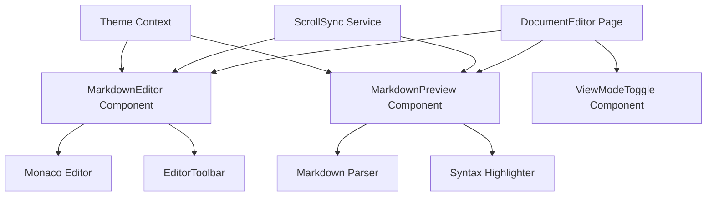

# 設計文書

## 概要

マークダウンプレビュー機能は、既存のライティングアプリケーションに統合される新しい機能です。ユーザーがマークダウン形式で文書を作成する際に、リアルタイムでプレビューを表示し、効率的な執筆体験を提供します。

## アーキテクチャ

### 全体構成



### コンポーネント階層

- **DocumentEditor Page**: メインのエディターページ
  - **MarkdownEditor**: マークダウンエディター部分
    - **EditorToolbar**: エディター用ツールバー
  - **MarkdownPreview**: プレビュー表示部分
  - **ViewModeToggle**: 表示モード切り替えコントロール
  - **ResizablePanel**: 分割表示用のリサイズ可能パネル

## コンポーネントとインターフェース

### 1. DocumentEditor Page

新しいルート `/editor` または `/documents/:id/edit` を追加し、マークダウンエディター機能を提供します。

```typescript
interface DocumentEditorProps {
  documentId?: string;
  initialContent?: string;
}

interface ViewMode {
  type: "editor-only" | "preview-only" | "split-horizontal" | "split-vertical";
}
```

### 2. MarkdownEditor Component

```typescript
interface MarkdownEditorProps {
  content: string;
  onChange: (content: string) => void;
  onScroll?: (scrollTop: number, scrollHeight: number) => void;
  syncScroll?: boolean;
  theme: "light" | "dark";
}
```

**主要機能:**

- Monaco Editorを使用したマークダウン編集
- シンタックスハイライト
- 自動保存機能
- スクロール位置の通知

### 3. MarkdownPreview Component

```typescript
interface MarkdownPreviewProps {
  content: string;
  onScroll?: (scrollTop: number, scrollHeight: number) => void;
  syncScroll?: boolean;
  theme: "light" | "dark";
}
```

**主要機能:**

- マークダウンからHTMLへの変換
- シンタックスハイライト（コードブロック用）
- 画像の表示
- リンクの処理
- スクロール位置の通知

### 4. ViewModeToggle Component

```typescript
interface ViewModeToggleProps {
  currentMode: ViewMode["type"];
  onModeChange: (mode: ViewMode["type"]) => void;
}
```

### 5. ScrollSync Service

```typescript
interface ScrollSyncService {
  syncEditorToPreview: (editorScrollRatio: number) => void;
  syncPreviewToEditor: (previewScrollRatio: number) => void;
  enableSync: () => void;
  disableSync: () => void;
  isEnabled: boolean;
}
```

## データモデル

### Document Model

```typescript
interface Document {
  id: string;
  title: string;
  content: string; // マークダウン形式
  lastEdited: Date;
  wordCount: number;
  tags: string[];
  status: "Draft" | "Review" | "Final";
}
```

### Editor State

```typescript
interface EditorState {
  content: string;
  viewMode: ViewMode["type"];
  scrollSyncEnabled: boolean;
  theme: "light" | "dark";
  isAutoSaveEnabled: boolean;
  lastSaved: Date | null;
}
```

## 技術スタック

### 新規依存関係

1. **@monaco-editor/react** - 高機能なコードエディター
2. **remark** - マークダウンパーサー
3. **remark-html** - HTML変換
4. **remark-gfm** - GitHub Flavored Markdown サポート
5. **prism-react-renderer** - シンタックスハイライト
6. **react-resizable-panels** - 既存（分割表示用）

### 既存技術の活用

- **React Router** - 新しいエディタールートの追加
- **Tailwind CSS** - スタイリング
- **Radix UI** - UIコンポーネント
- **Lucide React** - アイコン

## エラーハンドリング

### エラーケース

1. **マークダウンパースエラー**
   - 不正なマークダウン記法の処理
   - パーサーエラーの表示

2. **エディターエラー**
   - Monaco Editorの初期化失敗
   - 大きなファイルの処理

3. **自動保存エラー**
   - ネットワークエラー
   - ストレージエラー

### エラー処理戦略

```typescript
interface ErrorBoundaryState {
  hasError: boolean;
  errorType: "parser" | "editor" | "network" | "unknown";
  errorMessage: string;
}
```

- エラーバウンダリーでコンポーネントレベルのエラーをキャッチ
- ユーザーフレンドリーなエラーメッセージの表示
- 自動復旧機能（可能な場合）

## テスト戦略

### 単体テスト

1. **MarkdownEditor Component**
   - 入力内容の変更処理
   - スクロール同期機能
   - テーマ切り替え

2. **MarkdownPreview Component**
   - マークダウンからHTMLへの変換
   - 各種マークダウン記法の表示
   - シンタックスハイライト

3. **ScrollSync Service**
   - スクロール位置の計算
   - 同期の有効/無効切り替え

### 統合テスト

1. **エディターとプレビューの連携**
   - リアルタイム更新
   - スクロール同期
   - 表示モード切り替え

2. **自動保存機能**
   - 定期的な保存
   - エラー時の処理

### E2Eテスト

1. **基本的な編集フロー**
   - 文書の作成・編集・保存
   - プレビューの確認

2. **表示モードの切り替え**
   - 各モードでの正常動作
   - レスポンシブ対応

## パフォーマンス考慮事項

### 最適化戦略

1. **デバウンス処理**
   - プレビュー更新の遅延実行（300ms）
   - 自動保存の遅延実行（2秒）

2. **仮想化**
   - 大きなドキュメントでのスクロール性能
   - Monaco Editorの最適化設定

3. **メモ化**
   - マークダウンパース結果のキャッシュ
   - コンポーネントの不要な再レンダリング防止

```typescript
const MemoizedMarkdownPreview = React.memo(
  MarkdownPreview,
  (prevProps, nextProps) => {
    return (
      prevProps.content === nextProps.content &&
      prevProps.theme === nextProps.theme
    );
  }
);
```

## セキュリティ考慮事項

### XSS対策

1. **HTMLサニタイゼーション**
   - DOMPurifyを使用したHTML浄化
   - 危険なタグ・属性の除去

2. **CSP（Content Security Policy）**
   - インラインスクリプトの制限
   - 外部リソースの制限

### 入力検証

1. **ファイルサイズ制限**
   - 最大ファイルサイズの設定（10MB）
   - 大きなファイルの警告表示

2. **文字エンコーディング**
   - UTF-8エンコーディングの強制
   - 不正な文字の処理

## 国際化対応

### 多言語サポート

1. **UI文字列**
   - エラーメッセージの日本語化
   - ツールチップ・ラベルの多言語対応

2. **マークダウン記法**
   - 日本語文書での適切な表示
   - CJK文字の処理

## アクセシビリティ

### WCAG 2.1 AA準拠

1. **キーボードナビゲーション**
   - Tab順序の適切な設定
   - ショートカットキーの提供

2. **スクリーンリーダー対応**
   - ARIA属性の適切な設定
   - セマンティックなHTML構造

3. **色・コントラスト**
   - 十分なコントラスト比の確保
   - 色以外の情報伝達手段の提供
